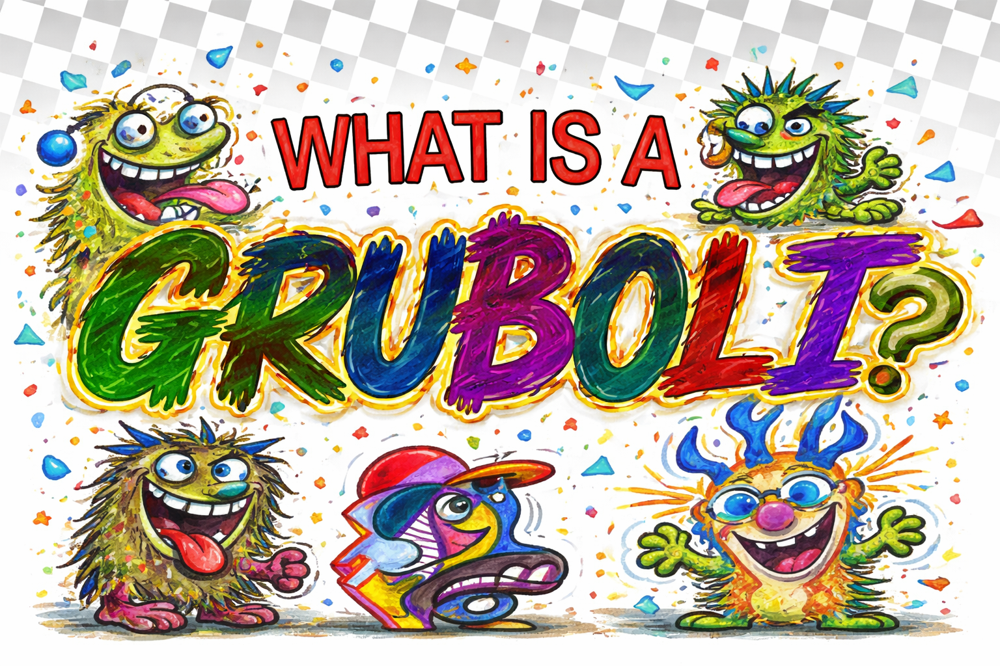

<em>Status: Active | Audience: Community, Clients, Collaborators | Doc-Type: Reference | Owner: Michael | Last Reviewed: 2026-08-02 | Canonical: No</em>

# Gruboli’s Concept Bible

## Core Premise

**Gruboli’s are characters that feel like they were rejected from the Muppets.**

That line is the fastest, clearest elevator pitch, but it is only the doorway. A Gruboli is not just a random monster, puppet knockoff, or noisy doodle-creature. A Gruboli is a lovable creative misfit: part monster, part mascot, part comedy bit, part emotional scribble, part design system.

They feel handmade, slightly wrong, immediately expressive, and impossible to ignore.

They are:

- messy but intentional
- weird but appealing
- chaotic but readable
- childlike but not babyish
- funny but not empty gag-characters
- ugly-cute in a way that becomes charming almost instantly

A Gruboli should feel like it escaped from a forgotten children’s show, got rejected for being too strange, and then found its true purpose in the Michaelplzno / Silverware creative universe.

## One-Sentence Definition

**Gruboli’s are expressive misfit creatures with puppet energy, doodle-DNA, and outsider charm—characters that look rejected by polished children’s media and embraced by imagination instead.**

## Short Version for Public-Facing Copy

**Gruboli’s are weird, lovable misfit creatures—like characters rejected from the Muppets and adopted by a more chaotic, more creative universe.**

## Expanded Definition

Gruboli’s are a character family / species / brand language built around the joy of expressive imperfection.

They are not meant to be slick, corporate, or over-sanitized. Their appeal comes from a combination of:

- hand-drawn charm
- puppet-like personality
- visual asymmetry and lovable awkwardness
- emotional immediacy
- strong silhouette and icon-readability
- a sense that each one has a voice, a flaw, and a point of view

They can work as:

- standalone characters
- recurring cast members
- mascots
- stickers and avatars
- profile identities
- storybook characters
- short-form animation subjects
- merch art
- social media reaction characters
- worldbuilding elements in a larger Silverware ecosystem

## The Emotional Thesis

A Gruboli exists at the intersection of four feelings:

### 1. **Immediate visual delight**

You should want to look at it right away.

### 2. **Comic instability**

It feels like it might say the wrong thing, sing off-key, or break the scene in a funny way.

### 3. **Unexpected sweetness**

Even a gross or chaotic Gruboli should usually have some spark of innocence, vulnerability, or enthusiasm.

### 4. **Creative freedom**

A Gruboli should feel like permission to make something stranger, looser, and more alive than polished mainstream character design usually allows.

## Brand Positioning

The Gruboli’s are not simply “monster characters.” They are best understood as a **misfit character platform**.

That means they can support multiple creative uses under one umbrella:

- editorial illustration
- avatar identity system
- children’s-book parody / anti-book energy
- collectible cast design
- social reactions and emotes
- character generator systems
- personality quizzes
- storytelling ensembles
- licensing-ready mascot families

In other words, **Gruboli’s are not just a cast; they are a framework.**

## The Big Hook

### “Rejected from the Muppets”

This phrase works because it instantly communicates:

- puppet-adjacent energy
- humor
- character-first design
- lovable weirdness
- mainstream-adjacent familiarity with outsider status

But the Gruboli’s should not feel derivative. The phrase is a shorthand, not the endpoint.

The real identity is:
**They are emotionally readable oddballs with handmade soul.**

That means their design language can pull from:

- puppet culture
- children’s books
- doodle art
- collage
- low-fi craft aesthetics
- scribbly monster design
- absurdist comedy
- outsider art
- mascot branding

without becoming a copy of any one thing.

## What Makes a Gruboli a Gruboli?

A character feels like a true Gruboli when most of these are present:

### Visual traits

- bold, clear silhouette
- exaggerated facial features
- expressive eyes or eye-shapes
- odd but readable mouth / teeth / tongue treatment
- texture that feels handmade, drawn, fuzzy, papery, marker-y, cutout, or puppet-adjacent
- shapes that are a little wrong in a good way
- color that feels playful and emotionally loud
- enough design discipline that the chaos still reads clearly

### Personality traits

- one strong emotional angle at first glance
- a built-in contradiction
- comic vulnerability
- outsider energy
- specific attitude
- feels like it could have a catchphrase, sound, or physical bit

### Conceptual traits

- not generic
- not too cool
- not too clean
- not purely gross
- not trying too hard to be “edgy”
- not overexplained
- instantly suggestive of a life beyond the image

## The Core Contradiction

A Gruboli should usually contain a contradiction. That tension is where the life comes from.

Examples:

- gross but lovable
- loud but insecure
- creepy but friendly
- dumb-looking but strangely wise
- chaotic but sincere
- childish but emotionally perceptive
- ridiculous but iconic
- rejected but unforgettable

Without contradiction, a Gruboli risks becoming just another goofy monster.

## Why They Matter

Gruboli’s are useful creatively because they do several jobs at once:

### They lower the barrier to character creation

Because imperfection is part of the system, you can discover characters quickly.

### They turn mistakes into style

Wrongness is not a flaw. Wrongness is often the point.

### They support worldbuilding without requiring realism

They can live in books, logos, social posts, videos, merch, and games.

### They are socially portable

People can pick a favorite, identify with one, or use one as a mini-identity.

### They fit the Michaelplzno ethos

They feel handmade, funny, odd, expressive, and anti-corporate in the best way.

## Avatar System Potential

One of the strongest directions for Gruboli’s is as an **avatar ecosystem**.

### Why that works

Gruboli’s are naturally:

- expressive
- modular
- collectible
- identity-friendly
- easy to vary while keeping family resemblance

### What a Gruboli avatar system could include

- body types
- eye styles
- mouth styles
- fuzz / skin / material styles
- spikes / horns / antennae / ears
- accessories
- signature color palettes
- emotional presets
- archetype classes
- voice / caption styles
- lore fragments

### User-facing promise

Instead of making a generic profile picture, a person could choose or generate a Gruboli that expresses:

- their mood
- their social identity
- their creative vibe
- their role in a community
- their humor level
- their chaos level

### Possible positioning line

**Build your Gruboli: the lovable reject version of yourself.**

Or:

**Pick the creature you would have been if children’s TV said “absolutely not.”**

## Archetype System

To make the concept scalable, Gruboli’s should have recognizable archetypes.

### 1. **The Gremlin Gruboli**

Small, twitchy, impulsive, troublemaking.

### 2. **The Softie Gruboli**

Fuzzy, warm, sensitive, big-hearted, maybe nervous.

### 3. **The Wise Fool Gruboli**

Looks ridiculous, says something unexpectedly profound.

### 4. **The Loudmouth Gruboli**

Big opinions, big mouth, big personality.

### 5. **The Holy / Cosmic Gruboli**

Mystical nonsense, accidental prophet, surreal spiritual vibes.

### 6. **The Costume Gruboli**

A Gruboli whose whole identity is wrapped up in a strange outfit, role, or persona.

### 7. **The Clown Gruboli**

Comic anxiety, performance energy, laughter with a little menace.

### 8. **The Wrong Animal Gruboli**

Part creature, part mascot, part unconvincing species mashup.

These categories should not feel restrictive; they are handles for expansion.

## Visual Style Pillars

### Pillar 1: **Handmade first**

Even when polished digitally, the image should remember the hand.

### Pillar 2: **Readable silhouette**

A Gruboli should still be recognizable from across the room.

### Pillar 3: **One dominant emotional read**

We should instantly understand the vibe.

### Pillar 4: **Controlled chaos**

The design can be weird, but it cannot be muddy.

### Pillar 5: **Imperfection with intention**

Awkwardness must feel chosen, not accidental or lazy.

## Design Rules

### Must-have qualities

- strong personality at a glance
- at least one memorable feature
- playful asymmetry or strange proportion
- a tactile or hand-touched feeling
- color choices with energy
- a shape language that can be repeated across a family

### Avoid

- generic horror-monster tropes
- overly sleek animation-studio polish
- bland “cute mascot” emptiness
- too many random details fighting each other
- meanness without charm
- grossness without wit
- copyright-adjacent mimicry of known puppet franchises

## Voice and Tone

Gruboli voice should feel like:

- weirdly sincere
- childlike but not infantile
- self-aware but not too meta
- oddball funny
- occasionally profound by accident
- emotionally direct
- a little scrappy

### Good tonal neighbors

- forgotten children’s media
- fake educational books
- sketchbook creatures
- public-access puppet energy
- absurd sincerity
- anti-perfection comedy

### Bad tonal neighbors

- mean internet snark
- sterile branding copy
- horror-first creepiness
- cynical irony with no heart

## Lore Frame Options

The Gruboli’s do not need one rigid canon, but they benefit from a flexible frame.

### Option A: The Rejected Cast

They were almost part of a beloved puppet / educational universe, but were deemed too odd, too unruly, too emotionally unstable, too hard to merchandise, or too confusing for parents.

### Option B: The Lost Alphabet / Lost Show

They originated in failed educational content, abandoned pilots, forgotten books, or corrupted learning materials.

### Option C: The Avatar Dimension

They are emotional creature-forms people adopt as identities.

### Option D: The Misfit Studio System

They are the surviving creations from an alternate children’s media factory where the strangest ideas slipped through.

The best approach may be to keep all of these as overlapping truths depending on format.

## Story Logic

A Gruboli story should usually begin with one of these tensions:

- trying to belong
- misunderstanding the assignment
- treating nonsense very seriously
- taking a literal approach to something abstract
- failing in a memorable way
- discovering unexpected value in being “wrong”
- turning rejection into identity

That makes them especially good for:

- shorts
- picture books
- fake educational pages
- intro cards
- collectible bios
- animated loops
- social posts

## Relationship to Education / Alphabet Content

The alphabet-book angle is strong because it creates a built-in comic contrast between **educational certainty** and **Gruboli chaos**.

That’s funny on its own.

A “perfect alphabet book” with obviously wrong or unstable creatures instantly gives the concept tension.

Possible recurring themes:

- educational materials gone off-script
- lessons that almost work
- sincerity colliding with absurdity
- children’s format used for surreal comedy

That gives Gruboli’s a powerful lane:
**fake educational media that reveals character instead of teaching correctly.**

## What the Name “Gruboli” Suggests

The word “Gruboli” feels:

- creature-ish
- chewy
- weirdly affectionate
- slightly gross but not revolting
- toyetic
- made-up in the right way
- memorable once heard

That is good. It sounds like a species, a problem, and a brand at the same time.

That ambiguity is an asset.

## The Michaelplzno Connection

Gruboli’s make sense inside the Michaelplzno universe because they align with recurring strengths:

- expressive distortion
- hand-drawn character
- odd humor
- colorful shape play
- anti-boring design instincts
- affection for misfits
- commercial potential without sanding off the weirdness

They feel like a natural extension of the coffee-doodle / warped-character / emotionally loud visual language you already gravitate toward.

## Commercial / Practical Applications

Gruboli’s could live as:

- article / essay centerpiece IP
- book concept
- sticker packs
- enamel pins
- plush candidates
- profile avatars
- social emotes
- reaction images
- printable cards
- mystery-character packs
- website mascots
- game NPC species
- collectible roster pages
- apparel graphics
- creator-collab templates

## The Key Test

When evaluating a new Gruboli, ask:

### The Gruboli Test

- Is it instantly expressive?
- Is it weird in a specific way?
- Is it readable from a distance?
- Does it feel handmade or soul-touched?
- Does it contain at least one contradiction?
- Could someone pick it as “their” Gruboli?
- Does it feel rejected by polish and rescued by personality?

If yes, it’s probably working.

## Positioning Statements

### Clean

**Gruboli’s are lovable misfit characters with puppet energy and handmade soul.**

### Fun

**Like the Muppets said no, and imagination said yes.**

### Article-ready

**Gruboli’s are the creatures that polished children’s media would reject for being too strange, too emotional, too lopsided, and too alive. That’s exactly why they work.**

### Avatar-ready

**Gruboli’s are expressive creature-avatars for people who would rather be memorable than normal.**

## Draft Manifesto

Gruboli’s are not clean. They are not perfect. They are not focus-grouped into harmlessness.

They are creatures of personality.

They are the lovable leftovers, the unstable mascots, the emotional doodles, the fuzzy mistakes that became stars.

They look like they were rejected from a safer, shinier world.

Good.

That rejection is their origin story.

Because once a character stops trying to behave, it can finally become itself.

That is a Gruboli.

## Working Article Structure

If you want to turn this into a polished article, a strong structure would be:

1. Hook: “Rejected from the Muppets”
2. Why that phrase works instantly
3. What Gruboli’s actually are beyond the joke
4. The design philosophy of expressive imperfection
5. Why misfit characters matter
6. How Gruboli’s can function as avatars
7. What makes a Gruboli visually and emotionally successful
8. Why the concept fits your broader creative universe
9. Closing manifesto / invitation

## Possible Closing Line

**The Gruboli’s are what happens when a character is too strange for the official version of childhood—but too alive to disappear.**
